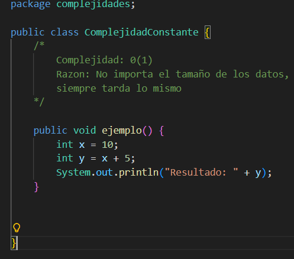
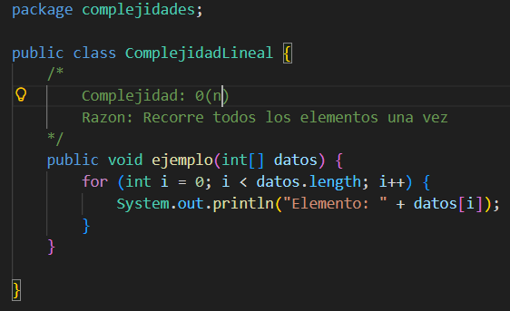
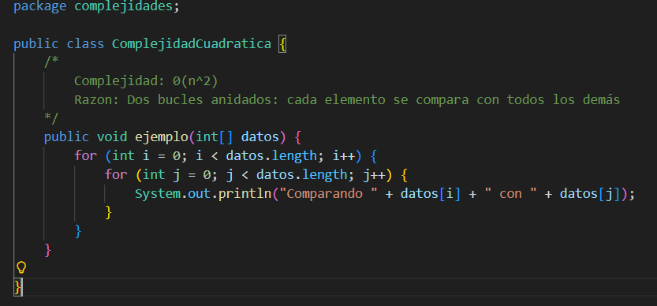
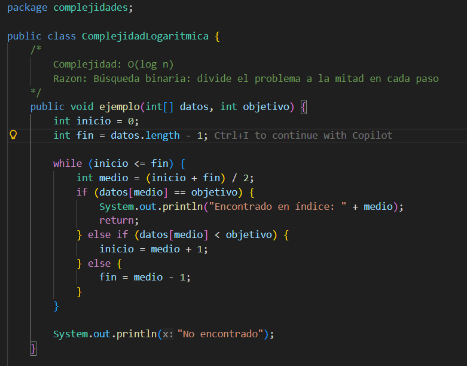
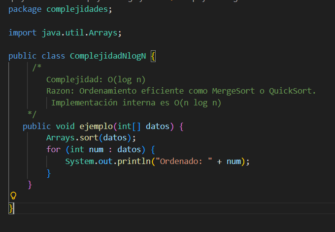

# **INFORME DE INVESTIGACION**

LOGO CARRERA

### **Asignatura:** Estructura de Datos

### **Tema:** Proyecto de Complejidad y Eficiencia de Algoritmos

# Integrantes:
- Nombre Completo 1 - Enlace a GitHub
- Nombre Completo 1 - Enlace a GitHub

# Objetivos:

Colocar aquí los objetivos del trabajo.

# Marco Teórico: 

Colocar aquí el marco teórico del trabajo, los conceptos y definiciones relevantes.

## **1. Teoría de la Complejidad**

*(Aquí el estudiante coloca su investigación)*

### 1.1 Definición general

### 1.2 Importancia en la resolución de problemas

### 1.3 Eficiencia de algoritmos

* Coste temporal
* Coste espacial

### 1.4 Factores de tiempo de ejecución

* Factores propios
* Factores circunstanciales
* Análisis teórico
* Análisis experimental

### 1.5 Notación de complejidad

* Big O
* Mejor caso
* Peor caso
* Caso promedio
* Big O, Ω, Θ

---

## **2. Ejemplos de Complejidad en Java**

En esta sección se presentan las clases creadas dentro del proyecto y el análisis correspondiente a cada una.

---

## **2.1 Complejidad O(1) – Constante**

### **Archivo:** `ComplejidadConstante.java`

### **Código del ejemplo**

### **Explicación resumida**

El tiempo de ejecución no depende del tamaño de los datos. 
Siempre se ejecuta en la misma cantidad de pasos.

---

## **2.2 Complejidad O(n) – Lineal**

### **Archivo:** `ComplejidadLineal.java`

### **Código del ejemplo**

### **Explicación resumida**

El tiempo de ejecución crece proporcionalmente al número de elementos. 
Si hay 10 elementos, se hacen 10 operaciones.

---

## **2.3 Complejidad O(n^2) – Cuadratica**

### **Archivo:** `ComplejidadCuadratica.java`

### **Código del ejemplo**

### **Explicación resumida**

Cada elemento se compara con todos los demás.
Si hay n elementos, se hacen n × n operaciones.

---

## **2.4 Complejidad O(log n) – Logartimica**

### **Archivo:** `ComplejidadLogaritmica.java`

### **Código del ejemplo**

### **Explicación resumida**

El conjunto se divide a la mitad en cada paso,
reduciendo drásticamente el número de operaciones.
Ideal para datos ordenados.

---

## **2.5 Complejidad O(n log n) – Lineal-Logaritmica**

### **Archivo:** `ComplejidadNlogN.java`

### **Código del ejemplo**

### **Explicación resumida**

*(Aquí el estudiante explica por qué es O(1))*

---

# **Conclusiones**

*(Aquí el estudiante agrega conclusiones propias del trabajo)*

**POR ESTUDIANTE**: *(Nombre completo del estudiante)*

---

